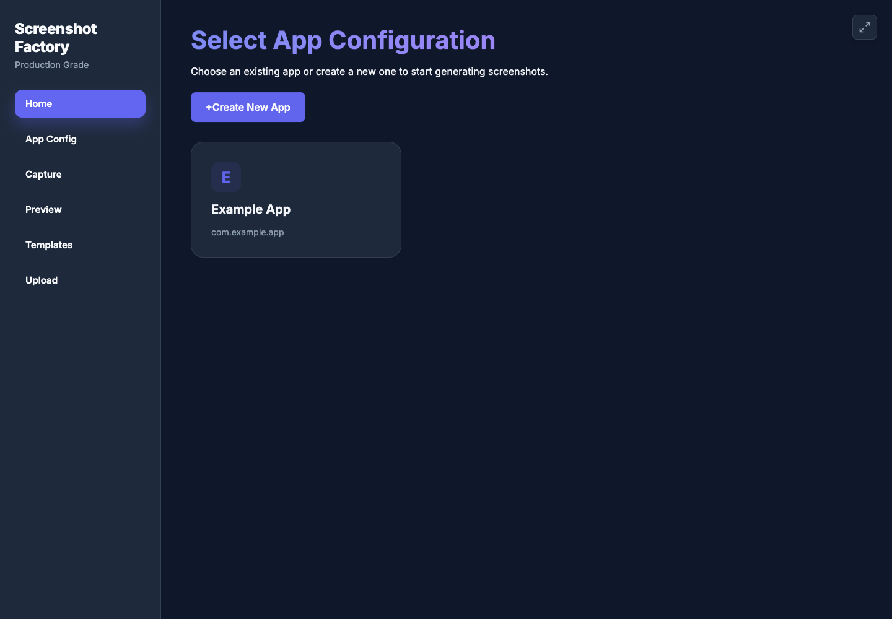
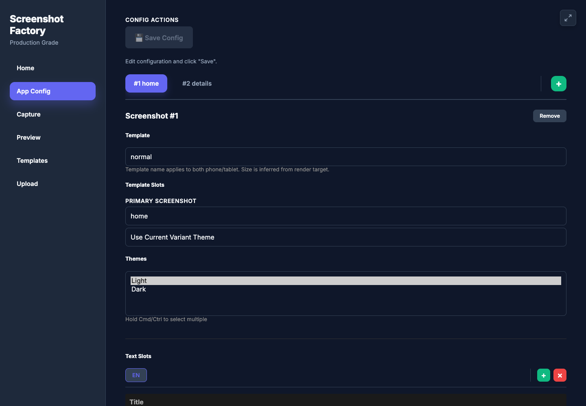
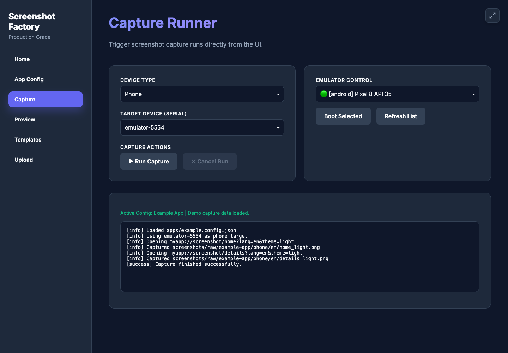
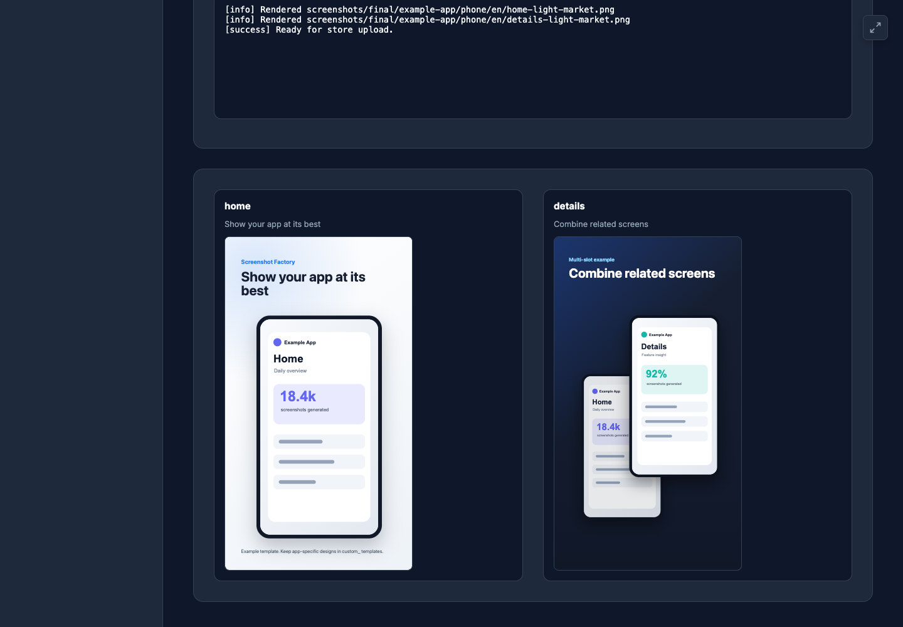
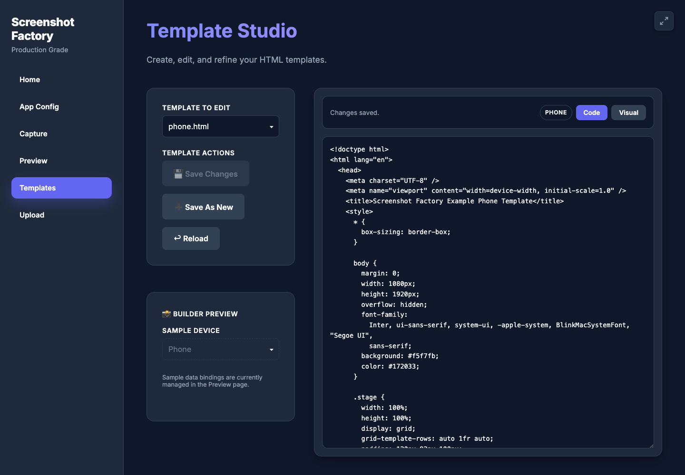
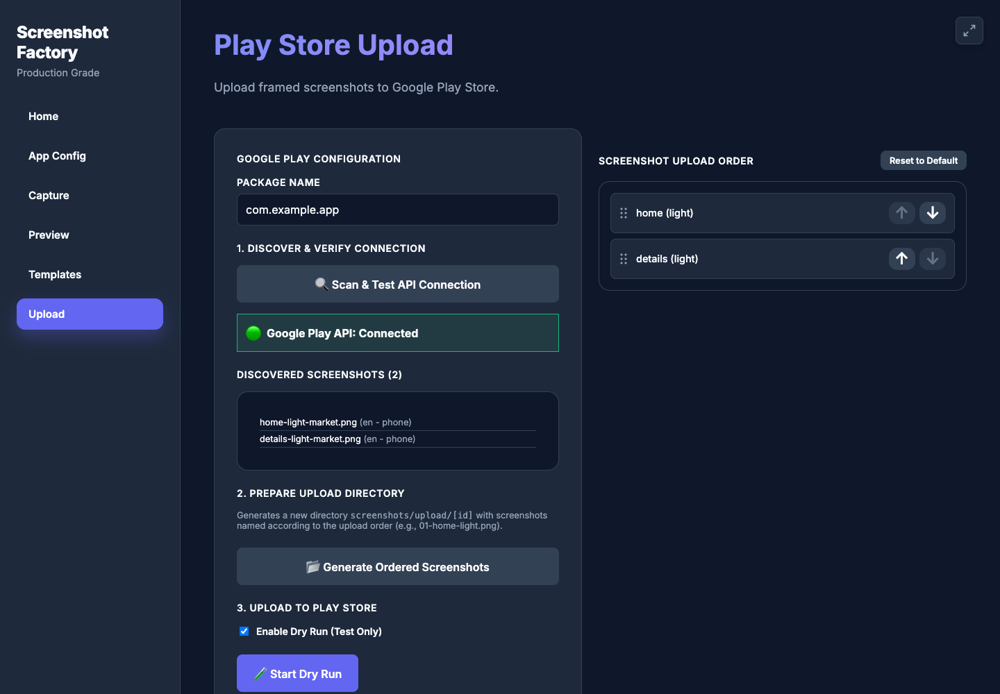

# Screenshot Factory

Screenshot Factory is a local developer tool for producing app-store screenshots without turning
the process into a manual design chore every release.

It was built for mobile apps, especially Android and Capacitor apps, that need repeatable
screenshots across devices, locales, scenes, themes, and marketing layouts. You describe the app
screens once, trigger those screens through deep links, capture raw device screenshots, and render
store-ready images from reusable HTML templates.

## What It Does

- Captures screenshots from a connected Android device or emulator with `adb`.
- Opens app scenes through deep links like `myapp://screenshot/home?lang=en&theme=dark`.
- Renders final phone/tablet marketing screenshots with Puppeteer and HTML templates.
- Supports localized titles, theme variants, and multi-slot templates.
- Provides both a CLI and a local browser UI for managing configs, capture runs, previews,
  templates, and Play Store upload preparation.

## Why This Exists

Store screenshots are easy to neglect because they sit between engineering, localization, design,
and release operations. Screenshot Factory keeps that workflow close to the app code and makes it
repeatable:

1. Keep an app config in `apps/`.
2. Capture raw screenshots from the app.
3. Preview templates locally.
4. Render final store assets.
5. Optionally prepare or upload the screenshots for Google Play.

## Requirements

- Node.js `>= 18`
- npm
- Android SDK with `adb` available in `PATH`
- A connected Android device or running Android emulator for capture
- Chromium dependencies required by Puppeteer for rendering

Optional:

- Xcode CLI tools on macOS if you want the UI to list or boot iOS simulators.

## Quick Start

Install dependencies:

```bash
npm install
```

Start the local UI/API server:

```bash
npm run dev
```

Open [http://localhost:8000](http://localhost:8000).

Use the example config as a starting point:

```bash
cp apps/example.config.json apps/my-app.json
```

Then edit `apps/my-app.json` with your app id, package name, scene list, locales, optional APK
path, and optional Play Store service-account key path.

## Local Tooling Note

Screenshot Factory is designed as a trusted local developer tool. The dev server can read and
write app configs, edit templates, serve local screenshots, and start capture/render/upload jobs.
Run it on your own machine and do not expose the dev server to an untrusted network.

## CLI Usage

Capture raw screenshots:

```bash
npm run cli -- run apps/my-app.json
```

Render final images:

```bash
npm run cli -- render apps/my-app.json
```

Useful capture options:

- `-d, --device <id>`: choose an adb serial
- `-t, --type <type>`: `phone` or `tablet`
- `-v, --verbose`: verbose logging
- `-f, --force`: continue even if APK installation fails

Render options:

- `-t, --type <type>`: `phone` or `tablet`

## Browser UI

The UI is the easiest way to work day to day:

- `Home`: select or create an app config from `apps/*.json`.
- `App Config`: edit scenes, locales, text slots, templates, themes, and slot bindings.
- `Capture`: choose a device/emulator and run screenshot capture jobs.
- `Preview`: inspect single scenes or preview all outputs before rendering.
- `Templates`: edit and create local HTML templates.
- `Upload`: prepare screenshots for Play Store upload and run uploads when configured.

<!-- readme-screenshots:start -->
### UI Screenshots

| Home | App Config | Capture |
| --- | --- | --- |
|  |  |  |

| Preview | Templates | Upload |
| --- | --- | --- |
|  |  |  |
<!-- readme-screenshots:end -->

## App Configs

App configs live in `apps/*.json`. Private configs are ignored by default, while
`apps/example.config.json` is tracked as a public starter.

Configs may reference app-owned files outside this repo:

- `apkPath`: optional path to an APK to install before capture
- `uploadKeyPath`: optional path to a Google Play service-account JSON key

Minimal shape:

```json
{
  "id": "my-app",
  "name": "My App",
  "packageName": "com.example.myapp",
  "apkPath": "/absolute/path/to/app.apk",
  "uploadKeyPath": "/absolute/path/to/play-store-service-account.json",
  "scenes": ["home", "details"],
  "locales": ["en"],
  "sceneConfigs": [
    {
      "templateId": "normal",
      "slotSceneMap": {
        "primary": { "scene": "home", "theme": "$current" }
      },
      "themes": ["light"],
      "textSlots": {
        "title": {
          "en": "Show your app at its best"
        }
      }
    }
  ]
}
```

Important fields:

- `id`: used in screenshot output paths
- `packageName`: Android package name used by `adb`
- `scenes`: app routes/screens to capture
- `locales`: locale codes to pass to the app
- `sceneConfigs`: per-output template, theme, slot, and text configuration
- `slotSceneMap`: maps template slots such as `primary` or `secondary` to captured app scenes

Theme binding rules:

- Missing theme or `"$current"` uses the current capture/render variant.
- Explicit values like `"light"` or `"dark"` force that slot to use a specific theme.

## Templates

Templates are plain HTML files in `templates/`. During preview and render, Screenshot Factory loads
them with query parameters:

- `title`: localized title or text slot value
- `screenshot`: primary/fallback screenshot path
- `screenshots`: JSON map keyed by slot id
- `theme`: current theme variant, when present
- `darkMode=true`: included when the current theme is `dark`
- `t`: cache buster used by the preview UI

Public example templates:

- `normal` -> `templates/phone.html` and `templates/tablet.html`
- `example_multi` -> `templates/phone_example_multi.html` and
  `templates/tablet_example_multi.html`

Template metadata lives beside the HTML:

```json
{
  "name": "example_multi",
  "files": {
    "phone": "phone_example_multi.html",
    "tablet": "tablet_example_multi.html"
  },
  "slots": [
    { "id": "primary", "label": "Primary Screenshot", "required": true },
    { "id": "secondary", "label": "Secondary Screenshot", "required": true }
  ],
  "textSlots": [{ "id": "title", "label": "Main Title" }]
}
```

Private or app-specific templates should use the custom naming convention. These files are ignored
by git:

- `templates/custom_*.meta.json`
- `templates/*custom*.html`

Example:

- `templates/custom_modern.meta.json`
- `templates/phone_custom_modern.html`
- `templates/tablet_custom_modern.html`

## Output Layout

Raw captures:

```text
screenshots/raw/<appId>/<phone|tablet>/<locale>/<scene>.png
screenshots/raw/<appId>/<phone|tablet>/<locale>/<scene>_<theme>.png
```

Rendered outputs:

```text
screenshots/final/<appId>/<phone|tablet>/<locale>/<scene>-market.png
screenshots/final/<appId>/<phone|tablet>/<locale>/<scene>-<theme>-market.png
```

The `screenshots/` directory is ignored because it is generated output.

## Capacitor Integration

The helper in `src/contract/capacitor-snippet.ts` shows the app-side contract. It listens for URL
opens like:

```text
myapp://screenshot/<scene>?lang=<locale>&theme=<theme>
```

The snippet sets screenshot/marketing-mode flags and routes by scene. In a real app, you can use
the `lang` and `theme` query params to switch localization, seed mock data, or apply a visual theme
before the capture happens.

## API Summary

All endpoints are mounted under `/api`.

- `GET /api/apps`
- `GET /api/apps/:id`
- `PUT /api/apps/:id`
- `POST /api/config/read`
- `POST /api/config/save`
- `POST /api/config/create`
- `GET /api/templates`
- `GET /api/templates/:name`
- `PUT /api/templates/:name`
- `POST /api/templates`
- `POST /api/capture/run`
- `GET /api/capture/runs/:id`
- `DELETE /api/capture/runs/:id`
- `POST /api/render/run`
- `GET /api/render/runs/:id`
- `DELETE /api/render/runs/:id`
- `GET /api/devices`
- `GET /api/capture/emulators`
- `POST /api/capture/emulators/boot`
- Upload endpoints under `/api/upload`

## Development

Common commands:

```bash
npm run dev              # start local UI/API server
npm run cli -- run ...   # capture via CLI
npm run cli -- render ...# render via CLI
npm test                 # run Vitest
npm run lint             # ESLint + TypeScript check
npm run build            # backend build
npm run build:frontend   # frontend typecheck build
```

CI runs linting, tests, backend build, and frontend typechecking.

## Troubleshooting

### No connected device

```bash
adb devices
```

If no devices are listed, start an emulator or connect a physical device with USB debugging
enabled.

### Capture runs but the app does not navigate

Check that your app handles the screenshot deep link and that the package name is correct:

```bash
adb shell am start -W -a android.intent.action.VIEW -d "myapp://screenshot/home" com.example.myapp
```

### Render produced fewer files than expected

Common causes:

- a raw screenshot is missing for a scene/theme
- a required template slot is missing
- a template file referenced by metadata does not exist
- `sceneConfigs` and `scenes` are out of sync by index

Check the UI job logs or CLI output; missing inputs are reported there.

### Template preview looks wrong

- Empty template selection means `Use App Config (Auto)`.
- Non-empty template selection overrides the app config for preview.
- Check that `files.phone`, `files.tablet`, and slot ids in the metadata match the HTML template.

## Contributing

Contributions are welcome. Please read [CONTRIBUTING.md](CONTRIBUTING.md) before opening a pull
request.

## License

MIT. See [LICENSE](LICENSE).

